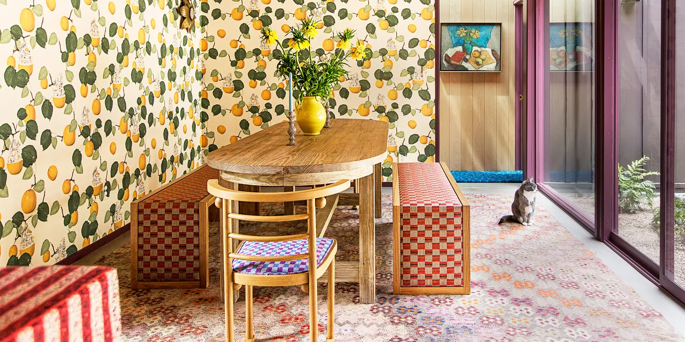

# Kotkantien Maalaus ja Tapetointi by Elmeri Kuvaja
Tavoitteenani oli tehdä tälle yritykselle nettisivu ja mielestäni onnistuin

## Kuvia nettisivusta
Tässä on Etusivu


Tässä on Palvelut sivu


Tässä on Galleria sivu


Tässä on Värien testaus sivu


Tässä on Ota yhteyttä sivu


## Kuvia koodista

Tässä koodissa näytetään navbaaria.

``` HTML
  <!-- Navigointipalkki Bootstrapin navbar-luokalla -->
  <nav class="navbar navbar-inverse">
    <div class="container-fluid">
      <div class="navbar-header">
        <!-- SVG-kuvake yrityksen logona -->
        <object data="./kuvat/paintbrush.svg" type="image/svg+xml"></object>
        <!-- Yrityksen nimi ja linkki kotisivulle -->
        <a class="navbar-brand" href="index.html">Kotkantien Maalaus ja Tapetointi</a>
      </div>
      <ul class="nav navbar-nav">
        <!-- Navigointilinkit -->
        <li class="active"><a href="index.html">Kotisivu</a></li>
        <li><a href="Palvelut.html">Palvelut</a></li>
        <li><a href="Galleria.html">Galleria</a></li>
        <li><a href="Värien_testaus.html">Värien testaus</a></li>
        <li><a href="Ota_yhteyttä.html">Ota yhteyttä</a></li>
      </ul>
    </div>
  </nav>
```

Tässä koodissa näytetään arvostelu karuselli etusivulta.

``` HTML
<div class="review-carousel">
    <!-- Yksi arvostelunäyttö kerrallaan, muut ovat piilossa -->
    <div class="review-item active">
        <p>★★★★★</p>
        <p><strong>Erinomainen kokemus!</strong></p>
        <p>"Palvelu oli loistavaa ja moitteetonta. Suosittelen ehdottomasti kaikille!" - Pekka Pouta.</p>
    </div>
    <div class="review-item">
        <p>★★★★★</p>
        <p><strong>Aivan huippu!</strong></p>
        <p>"Työntekijät olivat todella ystävällisiä ja hauskoja. Työt tehtiin huolellisesti ja tulos oli mahtava!" - Iines Ankka.</p>
    </div>
    <div class="review-item">
        <p>★★★★★</p>
        <p><strong>Yksinkertaisesti paras!</strong></p>
        <p>"Kaikki meni juuri kuten oli luvattu. Nyt aina, kun kävelen olohuoneeseeni en voi kuin ihailla" - Juha-Pekka Sillan-alla.</p>
    </div>
    <div class="review-item">
        <p>★★★★★</p>
        <p><strong>Mahtava kokemus!</strong></p>
        <p>"Yllätyin laadusta todella positiivisesti. Hinta-laatusuhde erinomainen!" - Kalle Keränen.</p>
    </div>
    <div class="review-item">
        <p>★★★★★</p>
        <p><strong>Täydellinen palvelu!</strong></p>
        <p>"Kaikki meni juuri niin kuin piti, ei mitään moitittavaa. Suosittelen lämpimästi!" - Raija Penttinen.</p>
    </div>
    <div class="review-item">
        <p>★★★★★</p>
        <p><strong>Tosi hyvä paikka!</strong></p>
        <p>"Ystävälliset työntekijät ja tuli laadukas seinä. Jos tulee taas tarvetta tilaamme täältä ihan varmasti!" - Eino Leino.</p>
    </div>

    <!-- Karusellin ohjausnapit -->
    <div class="carousel-controls">
        <button id="prev-btn">◀️ Edellinen</button>
        <button id="next-btn">Seuraava ▶️</button>
    </div>
  </div>
```
Tässä koodissa näytetään arvosteluiden CSS osiota

``` CSS
/* Karusellin säiliö */
.review-carousel {
    width: 80%;
    margin: 0 auto;
    overflow: hidden;
    position: relative;
    background-color: lightblue;
    border: 1px solid black;
    box-shadow: 0 4px 8px rgba(0, 0, 0, 0.1);
    padding: 20px;
    box-sizing: border-box;
}

/* Karusellin arvostelut */
.review-item {
    display: none;
}

/* Karusellin näkyvissä oleva arvostelu */
.review-item.active {
    display: block;
}

/* Nuoli-napit */
.carousel-controls {
    text-align: center;
    margin-top: 10px;
}

.carousel-controls button {
    background-color: deepskyblue;
    border: none;
    color: white;
    padding: 10px 20px;
    font-size: 16px;
    cursor: pointer;
    border-radius: 4px;
}

.carousel-controls button:hover {
    background-color: dodgerblue;
}
```

Tässä koodissa näytetään footer.

``` HTML
  <!-- Footer-osio -->
  <footer style="background-color: #eee6d3;">
    <div class="container p-4">
      <div class="row">
        <div class="col-lg-6 col-md-12 mb-4">
          <!-- Yrityksen esittelyteksti -->
          <h5 class="mb-3 text-dark">Meistä</h5>
          <p>
            Kotkantien maalaus ja tapentointi tekee sinulle semmoisen seinän minkä sinä täsmälleen haluat. Meilla on
            tiimissä 10 mallikasta tekijää joille ei ole ikinä tullut huonoa palautetta. Tavoitteemme on aina ylittää
            asiakkaamme odotukset meidän upealla laadullamme. Joten ota meihin yhteyttä ja eiköhän aleta hommiin!
          </p>
        </div>
        <div class="col-lg-3 col-md-6 mb-4">
          <!-- Yhteystiedot ja sosiaalisen median linkit -->
          <h5 class="mb-3 text-dark">Linkit</h5>
          <ul class="list-unstyled mb-0">
            <li class="mb-1">
              <a href="#!" style="color: #4f4f4f;">Puhelin 044 999 888 99</a>
            </li>
            <li class="mb-1">
              <a href="#!" style="color: #4f4f4f;">Sähköposti info@kotkantienmaalaus.fi</a>
            </li>
            <li class="mb-1">
              <a href="https://www.youtube.com/channel/UCaq6f6DGoCAq4YWvNyP5azQ" target="_blank"
                style="color: #4f4f4f;">Youtube</a>
            </li>
            <li>
              <a href="https://www.instagram.com/osao_tekniikka/" target="_blank" style="color: #4f4f4f;">Instagram</a>
            </li>
          </ul>
        </div>
        <div class="col-lg-3 col-md-6 mb-4">
          <!-- Google Maps -kartta yrityksen sijainnista -->
          <iframe
            src="https://www.google.com/maps/embed?pb=!1m18!1m12!1m3!1d1686.0773505864959!2d25.508349977652486!3d65.00146934481728!2m3!1f0!2f0!3f0!3m2!1i1024!2i768!4f13.1!3m3!1m2!1s0x4681cd5aac2e0dcb%3A0xd0f738d563fe562d!2sKotkantie%203%2C%2090250%20Oulu!5e0!3m2!1sen!2sfi!4v1723700718454!5m2!1sen!2sfi"
            width="400" height="200" style="border: 0;" allowfullscreen="" loading="lazy"
            referrerpolicy="no-referrer-when-downgrade"></iframe>
        </div>
      </div>
    </div>
    <!-- Tekijänoikeustiedot -->
    <div class="text-center p-3">
      Kotkantien Maalaus ja Tapetointi 2024 ©
    </div>
  </footer>
```
Tässä koodissa näytään galleria sivun kuvia

``` HTML
<div class="row">
    <div class="column">
      <h2>Maalaus</h2> <!-- Otsikko -->
      <p>Tällä puolella näät meidän hienot maalaus työt.</p> <!-- Kuvateksti -->
       <!-- Kuvagalleria -->
      
      
      
      
    </div>
    <div class="column">
      <h2>Tapetointi</h2> <!-- Otsikko -->
      <p>Tällä puolella näät meidän hienot tapetointi työt.</p> <!-- Kuvateksti -->
       <!-- Kuvagalleria -->
      
      
      
      
    </div>
  </div>
```
Tässä koodissa näytetään värien testaus sivua

``` HTML
  <!-- Sisältöalue -->
  <div class="alue">
    <div class="test-areas">
      <!-- Testausalueet -->
      <div class="test-area" id="test-area-1">Pinta 1</div> <!-- Ensimmäinen testausalue -->
      <button id="reset-button">Poista Värit</button> <!-- Painike, jolla voi poistaa värit -->
      <div class="test-area" id="test-area-2">Pinta 2</div> <!-- Toinen testausalue -->
    </div>
    
    <!-- Väri-palette -->
    <div class="palette">
      <div class="color" data-color="#DD4132" style="background-color: #DD4132;">Fiesta</div> <!-- Väri: Fiesta -->
      <div class="color" data-color="#9E1030" style="background-color: #9E1030;">Jester Red</div> <!-- Väri: Jester Red -->
      <div class="color" data-color="#FE840E" style="background-color: #FE840E;">Turmeric</div> <!-- Väri: Turmeric -->
      <div class="color" data-color="#FF6F61" style="background-color: #FF6F61;">Living Coral</div> <!-- Väri: Living Coral -->
      <div class="color" data-color="#C62168" style="background-color: #C62168;">Pink Peacock</div> <!-- Väri: Pink Peacock -->
      <div class="color" data-color="#8D9440" style="background-color: #8D9440;">Pepper Stem</div> <!-- Väri: Pepper Stem -->
      <div class="color" data-color="#FFD662" style="background-color: #FFD662;">Aspen Gold</div> <!-- Väri: Aspen Gold -->
      <div class="color" data-color="#00539C" style="background-color: #00539C;">Princess Blue</div> <!-- Väri: Princess Blue -->
      <div class="color" data-color="#755139" style="background-color: #755139;">Toffee</div> <!-- Väri: Toffee -->
      <div class="color" data-color="#D69C2F" style="background-color: #D69C2F;">Mango Mojito</div> <!-- Väri: Mango Mojito -->
      <div class="color" data-color="#616247" style="background-color: #616247;">Terrarium Moss</div> <!-- Väri: Terrarium Moss -->
      <div class="color" data-color="#E8B5CE" style="background-color: #E8B5CE;">Sweet Lilac</div> <!-- Väri: Sweet Lilac -->
      <div class="color" data-color="#D2C29D" style="background-color: #D2C29D;">Soybean</div> <!-- Väri: Soybean -->
      <div class="color" data-color="#343148" style="background-color: #343148;">Eclipse</div> <!-- Väri: Eclipse -->
      <div class="color" data-color="#F0EAD6" style="background-color: #F0EAD6;">Sweet Corn</div> <!-- Väri: Sweet Corn -->
      <div class="color" data-color="#615550" style="background-color: #615550;">Brown Granite</div> <!-- Väri: Brown Granite -->
    </div>
  </div>

  <br>
```

Tässä koodissa näytetään värien testauksen Javascriptiä


``` Js

// Kun dokumentti on ladattu ja valmis
$(document).ready(function () {
    let selectedArea = null;

    // Valitse testialue, kun sitä klikataan
    $('.test-area').on('click', function () {
        // Poista 'selected' luokka aiemmin valitulta alueelta, jos se on olemassa
        if (selectedArea) {
            selectedArea.removeClass('selected');
        }
        // Merkitse klikattu alue valituksi
        selectedArea = $(this);
        selectedArea.addClass('selected');
    });

    // Sovella väriä valittuun testialueeseen, kun väri klikataan
    $('.color').on('click', function () {
        if (selectedArea) {
            const color = $(this).data('color'); // Hae väri data-attribuutista
            selectedArea.css('background-color', color); // Aseta taustaväri
            // Poista valinta ja nollaa valittu alue
            selectedArea.removeClass('selected');
            selectedArea = null;
        }
    });

    // Nollaa värit napin klikkauksella
    $('#reset-button').on('click', function () {
        $('.test-area').css('background-color', '').removeClass('selected'); // Tyhjennä taustavärit ja poista valinta
        selectedArea = null;
    });
});

```

Tässä koodissa näytetään ota yhteyttä sivun koodia

``` HTML

<div class="box-container">
        <div class="box">
            <form>
                <label for="name">Name:</label><br>
                <input type="text" id="name" name="Name" required><br>
                <label for="email">Sähköposti:</label><br>
                <input type="text" id="email" name="email" required><br><br>
                <input type="radio" id="maalaus" name="aihe" required value="MAALAUS">
                <label for="maalaus">Maalaus</label><br>
                <input type="radio" id="tapetointi" name="aihe" required value="TAPETOINTI">
                <label for="tapetointi">Tapetointi</label><br>
                <input type="radio" id="muu" name="aihe" required value="MUU">
                <label for="muu">Muu aihe</label><br><br>
                <label for="muutxt">Muu aihe: (optional)</label><br>
                <input type="text" id="muutxt" name="Muutxt"><br><br>
                <label for="viesti">Viesti:</label><br>
                <input type="text" id="viesti" name="Viesti" required><br><br>
                <input type="submit" value="Lähetä">
                <h3>Löydät meidät myös Instagramista ja Youtubesta!</h3>
                <div class="social-buttons">
                    <a href="https://www.instagram.com/osao_tekniikka/" target="_blank">
                        
                    </a>
                    <a href="https://www.youtube.com/channel/UCaq6f6DGoCAq4YWvNyP5azQ" target="_blank">
                        
                    </a>
                </div>
            </form>
        </div>
    </div>

```

Tässä koodissa näytetään ota yhteyttä sivun CSS koodia

``` CSS
.box {
    border: 1px solid black;
    padding: 20px;
    background-color: lightblue;
    width: 80%;
    box-shadow: 0 4px 8px rgba(0, 0, 0, 0.1);
    box-sizing: border-box;
}

form {
    font-family: Arial, Helvetica, sans-serif;
    text-align: center;
    display: flex;
    flex-direction: column;
    margin: 0 auto;
}

/* Make radio buttons bigger */
input[type="radio"] {
    transform: scale(1.3);
    margin-right: 10px;
}

/* Additional styling for the form elements */
input[type="text"],
input[type="submit"] {
    margin-bottom: 10px;
    width: 100%;
    padding: 8px;
    border: 2px solid lightgray;
    border-radius: 4px;
}

/* Style for submit button */
input[type="submit"] {
    color: black;
    background-color: deepskyblue;
    border: none;
    cursor: pointer;
    padding: 12px;
    font-size: 20px;
    border-radius: 4px;
}

input[type="submit"]:hover {
    background-color: dodgerblue
}

/* Styling for labels */
label {
    display: block;
    margin-bottom: 6px;
    font-size: 20px;
}

/* Social media buttons */
.social-buttons {
    display: flex;
    justify-content: center;
    gap: 50px;
    /* Space between icons */
    margin-top: 20px;
    /* Space above the social media icons */
}

.social-icon {
    width: 100px;
    height: 100px;
    object-fit: cover;
    /* Maintain aspect ratio and cover the area */
}

```
